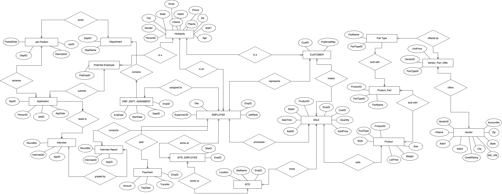

# 🏢 XYZ Company Database Management System

## 📋 Project Summary
This project implements a comprehensive relational database system for XYZ Company, a manufacturer that:
- 🛒 Buys parts from multiple vendors
- 🏪 Sells finished products through many marketing sites
- 📊 Maintains detailed records on departments, employees, customers, potential employees, job postings, interviews, salaries, sales, and purchase parts

The system includes a logical model, ER/EER models, dependency diagram, DDL/DML scripts, and a full-stack application built with React and Node.js to provide a user-friendly interface for database management.

## ❓ Project Questions

### 1️⃣ Business Rules
| # | Likely Rule | Why it Matters |
|:---:|-------------|----------------|
| 1 | Every product must include at least one part type (bill‑of‑materials cardinality ≥ 1). | Prevents orphan products with no composition data. |
| 2 | An employee cannot supervise them‑self. | Enforces hierarchical integrity for the supervisor relationship. |
| 3 | Each marketing site must stock at least one product to record a sale. | Ensures sales data stay meaningful. |
| 4 | A vendor's credit rating must be reviewed (or re‑entered) at least once per year. | Supports vendor risk management and purchasing decisions. |
| 5 | A customer can have only one "preferred sales representative" at any given time. | Avoids conflicting preferences and simplifies CRM workflows. |

### 2️⃣ Entity Inheritance
Yes. For example, people share common attributes: PersonID, name, age, gender, address, phones. They also split into overlapping roles—Employee, Customer, Potential Employee—and one person can belong to multiple roles concurrently.

### 3️⃣ Database Choice Justification
Relational databases are ideally suited for our project due to their inherent integrity mechanisms—such as primary and foreign keys, CHECK constraints, and triggers—which prevent department, interview, and payroll data from becoming inconsistent. The capabilities of SQL, including views and window functions, enable us to generate summaries (like average salaries, interview rounds completed, and part-cost aggregations) without excessive coding. Overall, the relational model aligns seamlessly with our highly tabular and relationship-intensive dataset, providing us with the potential for future scalability.

## 📊 EER Diagram


## 🔗 Logical Dependency Diagram


## 🎬 Demo Video
[](https://youtu.be/O0yGCJtcyq0)

## ✨ Features
- 👥 Employee management and hierarchy tracking
- 🏭 Vendor relationship and part procurement
- 🔧 Product composition (bill-of-materials)
- 🤝 Customer relationship management
- 📝 Job posting and applicant tracking
- 🎯 Interview scheduling and evaluation
- 📈 Sales tracking across marketing sites
- 🏢 Department and payroll management

## 🚀 Setup Instructions

### 🔑 Environment Configuration
Make sure to set up `.env` in `/server` as the following:
```
DB_HOST=localhost
DB_USER=INSERT
DB_PW=INSERT
DB_NAME=company
```

### 💾 Database Setup
Make sure to run DDL (ddl.sql), (dml.py), and views.sql.

### 🖥️ Running the Application
In two separate terminals, run the following:

**Terminal 1:**
```
cd server && npm install
node index.js
```

**Terminal 2:**
```
cd client && npm install
npm run dev
```
